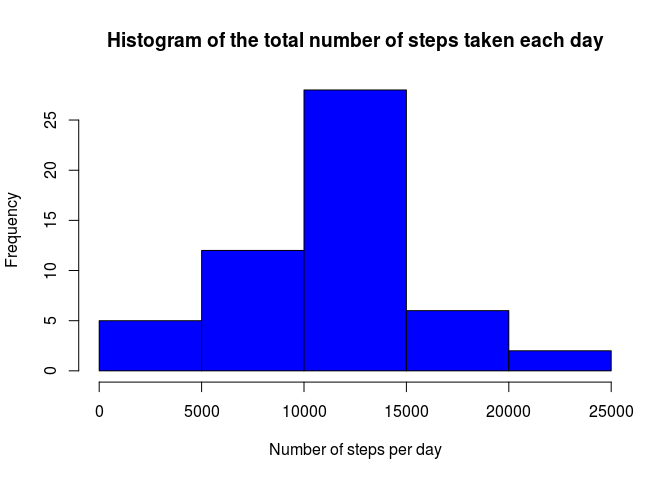
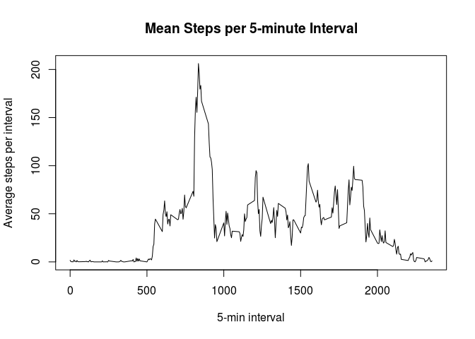
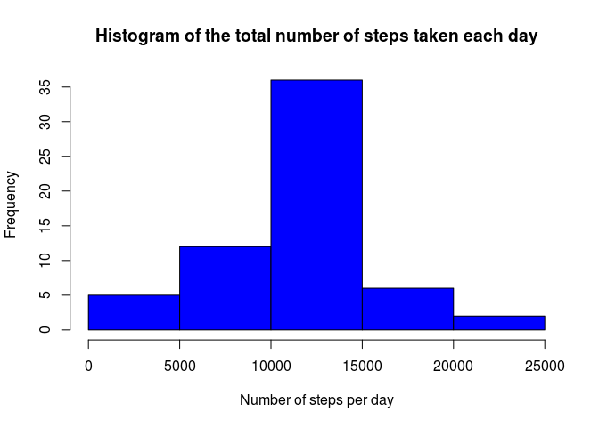
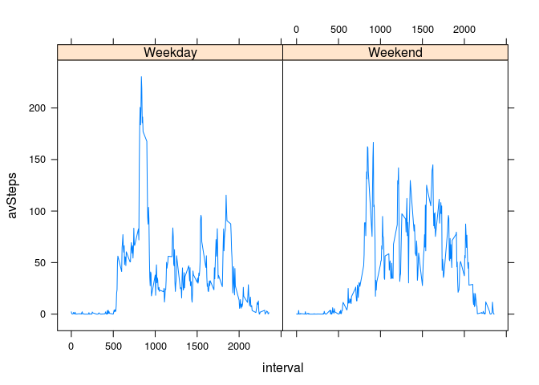

## Loading and preprocessing the data


```r
data <- read.csv('activity.csv', header=TRUE)
```

## What is mean total number of steps taken per day?

Calculate the total number of steps taken per day


```r
daily.steps <- tapply(data$steps, data$date, sum)
```

Histogram of the total number of steps taken each day


```r
hist(daily.steps, xlab='Number of steps per day', col='blue', 
     main = 'Histogram of the total number of steps taken each day')
```

<!-- -->

Mean number of steps taken per day


```r
mean(daily.steps, na.rm=TRUE)  #Ignoring NA days
```

```
## [1] 10766.19
```

Median number of steps taken per day


```r
median(daily.steps, na.rm=TRUE)  #Ignoring NA days
```

```
## [1] 10765
```

## What is the average daily activity pattern?

Make a time series plot (i.e. type = "l") of the 5-minute interval (x-axis) and the average number of steps taken, averaged across all days (y-axis)

```r
interval.steps <- tapply(data$steps, data$interval, mean, na.rm=TRUE)
data2 <- as.data.frame(interval.steps)
data2$intervals <- data$interval[0:length(interval.steps)]
with(data2, plot(intervals, interval.steps, type='l', xlab='5-min interval', 
                ylab='Average steps per interval', main='Mean Steps per 5-minute Interval'))
```

<!-- -->

Which 5-minute interval, on average across all the days in the dataset, contains the maximum number of steps?


```r
i <- which.max(data2$interval.steps)
```
Interval number 835 has the most steps on average, with 206.1698113


## Inputing missing values

The total number of days with missing values is:


```r
length(unique(data$date[is.na(data$steps) == TRUE]))
```

```
## [1] 8
```

Devise a strategy for filling in all of the missing values in the dataset. The strategy does not need to be sophisticated. For example, you could use the mean/median for that day, or the mean for that 5-minute interval, etc.

Create a new dataset that is equal to the original dataset but with the missing data filled in.
Make a histogram of the total number of steps taken each day and Calculate and report the mean and median total number of steps taken per day. Do these values differ from the estimates from the first part of the assignment? What is the impact of imputing missing data on the estimates of the total daily number of steps?


```r
interval.steps <- rep(interval.steps, length(data$steps)/length(interval.steps))
data$clean.steps <- data$steps
data$clean.steps[is.na(data$clean.steps)] <- interval.steps[is.na(data$clean.steps)]
revised.steps <- tapply(data$clean.steps, data$date, sum)

hist(revised.steps, xlab='Number of steps per day', col='blue', main = 'Histogram of the total number of steps taken each day')
```

<!-- -->

```r
mean(revised.steps)
```

```
## [1] 10766.19
```

```r
median(revised.steps)
```

```
## [1] 10766.19
```
Replacing the missing data with the average for the 5-minute interval changes the mean number of steps by 0 steps, and the median by 1.1886792 steps.


## Are there differences in activity patterns between weekdays and weekends?

For this part the weekdays() function may be of some help here. Use the dataset with the filled-in missing values for this part.

1. Create a new factor variable in the dataset with two levels – “weekday” and “weekend” indicating whether a given date is a weekday or weekend day.
    
2. Make a panel plot containing a time series plot (i.e. type = "l") of the 5-minute interval (x-axis) and the average number of steps taken, averaged across all weekday days or weekend days (y-axis). See the README file in the GitHub repository to see an example of what this plot should look like using simulated data.


```r
data$day.type <- as.factor(ifelse(weekdays(as.Date(data$date)) %in% c("Saturday","Sunday"), 
                                  "Weekend", "Weekday"))
data3 <- as.data.frame(rep(unique(data$interval), 2))
colnames(data3) <- "interval"
data3$dayType <- c(rep('Weekday', length(unique(data$interval))), 
                       rep('Weekend',length(unique(data$interval))))
x1 <- tapply(data$clean.steps[data$day.type == "Weekday"], 
             data$interval[data$day.type == "Weekday"], mean)
x2 <- tapply(data$clean.steps[data$day.type == "Weekend"], 
             data$interval[data$day.type == "Weekend"], mean)
data3$avSteps <- c(x1,x2)

library(lattice)
xyplot(avSteps ~ interval | dayType, data = data3, type = 'l')
```

<!-- -->
